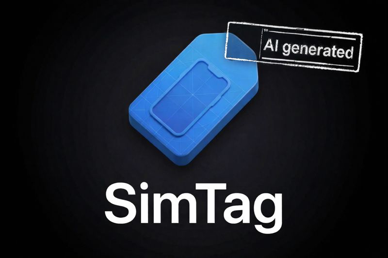

# SimTag (Experimento IA)

> Este proyecto es un experimento inspirado en la herramienta oficial [SimTag](https://aryamansharda.gumroad.com/l/sim-tag?ref=digitalbunker.dev), pero generado con IA como prueba de concepto. No es una versión oficial ni está afiliado al autor original.

## Descripción
SimTag es una utilidad para macOS que permite superponer información relevante sobre las ventanas de simuladores de Xcode. Sus principales funcionalidades incluyen:

- Detección automática de simuladores activos.
- Superposición de información como nombre del repositorio, rama de Git y estado de cambios.
- Integración con la barra de menú para ajustes rápidos y permisos.
- Persistencia de configuraciones personalizadas.
- Detección de repositorios en carpetas de DerivedData.
- Gestión de permisos para capturas de pantalla y overlays.
- Monitorización de cambios en repositorios Git.

---
# 
